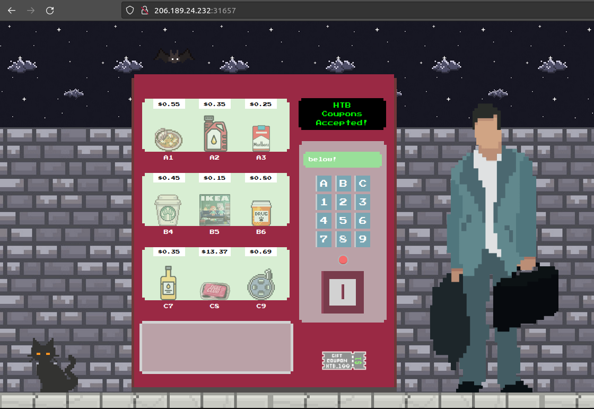
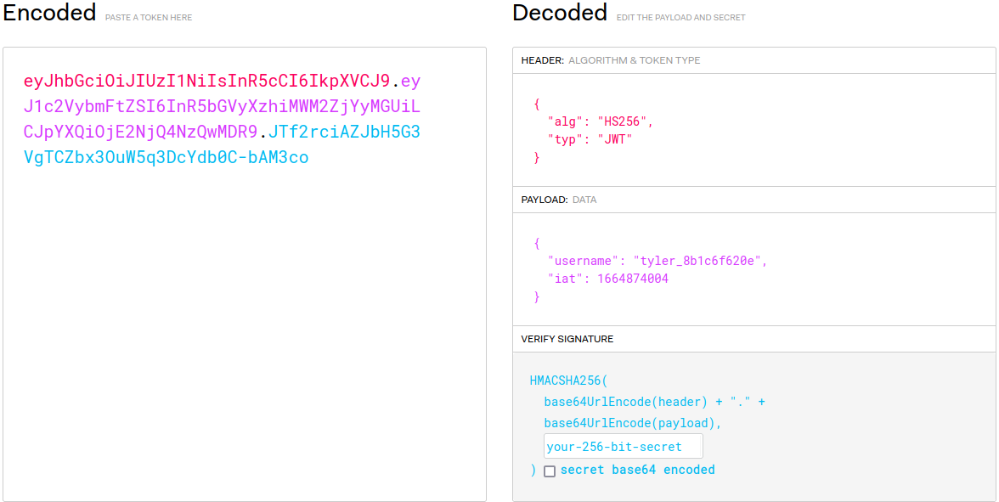
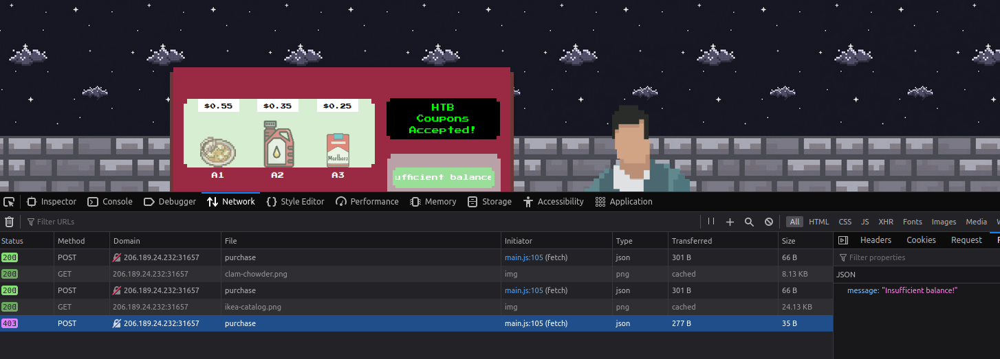

# Diogenes' Rage

## Abstract
*Category* : **Web Challenge**<br/>
*Challenge name* : **Diogenes' Rage**<br/>
*Host* : `206.189.24.232:31657`<br/>
*Description* : aving missed the flight as you walk down the street, a wild vending machine appears in your way.<br/>
You check your pocket and there it is, yet another half torn voucher coupon to feed to the consumerism.<br/>
You start wondering why should you buy things that you don't like with the money you don't have for the people you don't like.<br/> 
You're Jack's raging bile duct.<br/>
*Status* : **SOLVED**

## Walktrough
This is a web challenge, let's check the website:<br/>


<div style="width: 65%; height: 65%">

  
  
</div>  
<br/>

We are able to play with a vending machine by inserting (drag and drop) a coupon and selecting the product we want. <br/>
While we are doing this, we inspect the requests that the page make with our browser dev tools.<br/><br/>
After we make our first purchase, a <a href="https://jwt.io/">JWT</a> session token is generated:<br/>

<div style="width: 65%; height: 65%">

  
  
</div>  
<br/>

If we make another purches and then another, the website tells us that we posses no more funds.<br/>

<div style="width: 65%; height: 65%">

  
  
</div>  
<br/>

Upon inspecting the source code that comes with the challenge, we note that the cookie is used to track user funds<br/>
and also that the code may be vulnerable to <a href="https://en.wikipedia.org/wiki/Race_condition">race conditions</a>.<br/>
we also learn that the flag is linked with the product `C8` (the most expensive one and the only one we cannot buy with our coupon).<br/>
Let's see if we can use this to our advantage by crafting a custom script to bypass this balance limit.<br/><br/>
Crafting this attack was particularly hard for me, I had it almost right but, in the end, I had to restore to the help of the web 😊<br/>
You can find it in the `exploit` folder.<br/>
In the end we can launch our script and get the flag!<br/>
Note: Since race condition is random, you might have to run the exploit multiple time in order to get the flag.<br/>

```console
python3 race_condition_exploit.py                                                                                                                                                 ─╯
{"message":"Missing required parameters!"}
0.44548 sec
Done!!
{"message":"Thank you for your order! $2.45 coupon credits left!"}
{"message":"Insufficient balance!"}


{"message":"Missing required parameters!"}
0.51279 sec
Done!!
{"message":"Thank you for your order! $14.45 coupon credits left!"}
{"flag":"HTB{r4c3_w3b_d3f34t_c0nsum3r1sm}","message":"Thank you for your order! $1.08 coupon credits left!"}
```

  