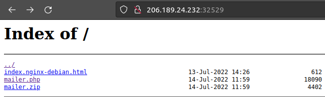

# Letter Dispair

## Abstract
*Category* : **web challenge** 
*Challenge name* : **Letter Dispair** 
*Host* : `206.189.24.232:32529` 
*Description* : A high-profile political individual was a victim of a spear-phishing attack. 
*Status* : *UNSOLVED* 
  
The email came from a legitimate government entity in a nation we don't have jurisdiction. 
 
However, we have traced the originating mail to a government webserver. 
 
Further enumeration revealed an open directory index containing a PHP mailer script we think was used to send the email.
  
We need access to the server to read the logs and find out the actual perpetrator. Can you help?

## Walktrough
Let's check the home page:
 

  
  

  

If we click on `mailer.zip` this file is downloaded on our local machine. 
if we extract it, we see a `mailer.php` file that, most likely, is the source of the `mailer` part of the website  
that we can access by clicking on the `mailer.php` link in the homepage of the website,

# To be completed, not yet resolved

