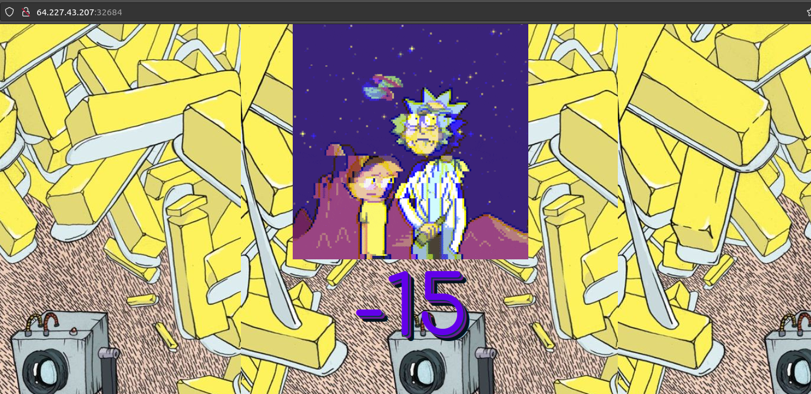

# interdimensional internet

## Abstract
*Category* : **web challenge**<br/>
*Challenge name* : **interdimensional internet**<br/>
*Host* : `64.227.43.207:32684`<br/>
*Description* : aw man, aw geez, my grandpa rick is passed out from all the drinking, where is a concentrated dark matter calculator when you need one, aw geez<br/>
*Status* : **SOLVED**

## Walktrough
Let's go to the homepage:<br/>
<div style="width: 65%; height: 65%">

  
  
</div> 
The first thing that I notice is that the number on the lower center of the screen changes every time I refresh the page<br/> 
the second thing thay I notice by inspetting the webpage with the browser developer's tools<br/>
is the presence of the `session` cookie with the value `eyJpbmdyZWRpZW50Ijp7IiBiIjoiY21wbmRHNTBhblZ0ZEE9PSJ9LCJtZWFzdXJlbWVudHMiOnsiIGIiOiJNellxTXpRPSJ9fQ.Yzbm4A.ck_jeKPrkoJGMWs5ZlHZetSummc`<br/>
This seems base64, Let's try to decode it:<br/>

```console
echo 'eyJpbmdyZWRpZW50Ijp7IiBiIjoiY21wbmRHNTBhblZ0ZEE9PSJ9LCJtZWFzdXJlbWVudHMiOnsiIGIiOiJNellxTXpRPSJ9fQ.Yzbm4A.ck_jeKPrkoJGMWs5ZlHZetSummc' | base64 -d
{"ingredient":{" b":"cmpndG50anVtdA=="},"measurements":{" b":"MzYqMzQ="}}base64: invalid input
```
The decoded string seems to represent an recipe object with the `ingredient` and `measurements` fields.<br/>
Maybe this is the recipe for the `concentrated dark matter calculator` the challenge description was talking about.
I try to perform a port scan against the host but it doesn't give any meaningful results.<br/>
Let's try with a directory enumeration via gobuster (you can also use dirbuster if you have it available).<br/>

```console
gobuster -u http://64.227.43.207:32684/ -w dir-list-medium.txt                                                                                                ─╯

=====================================================
Gobuster v2.0.1              OJ Reeves (@TheColonial)
=====================================================
[+] Mode         : dir
[+] Url/Domain   : http://64.227.43.207:32684/
[+] Threads      : 10
[+] Wordlist     : dir-list-medium.txt
[+] Status codes : 200,204,301,302,307,403
[+] Timeout      : 10s
=====================================================
2022/09/30 13:09:00 Starting gobuster
=====================================================
/debug (Status: 200)
=====================================================

```
The scan reports only the `\debug` folder so Let's take a look at it!<br/>
Mmmh...this is a python script!<br/>
```python
from flask import Flask, Response, session, render_template
import functools, random, string, os, re

app = Flask(__name__)
app.config['SECRET_KEY'] = os.environ.get('SECRET_KEY', 'tlci0GhK8n5A18K1GTx6KPwfYjuuftWw')

def calc(recipe):
    global garage
    builtins, garage = {'__builtins__': None}, {}
    try: exec(recipe, builtins, garage)
    except: pass

def GFW(func): # Great Firewall of the observable universe and it's infinite timelines
    @functools.wraps(func)
    def federation(*args, **kwargs):
        ingredient = session.get('ingredient', None)
        measurements = session.get('measurements', None)

        recipe = '%s = %s' % (ingredient, measurements)
        if ingredient and measurements and len(recipe) >= 20:
            regex = re.compile('|'.join(map(re.escape, ['[', '(', '_', '.'])))
            matches = regex.findall(recipe)
            
            if matches: 
                return render_template('index.html', blacklisted='Morty you dumbass: ' + ', '.join(set(matches)))
            
            if len(recipe) > 300: 
                return func(*args, **kwargs) # ionic defibulizer can't handle more bytes than that
            
            calc(recipe)
            # return render_template('index.html', calculations=garage[ingredient])
            return func(*args, **kwargs) # rick deterrent

        ingredient = session['ingredient'] = ''.join(random.choice(string.lowercase) for _ in xrange(10))
        measurements = session['measurements'] = ''.join(map(str, [random.randint(1, 69), random.choice(['+', '-', '*']), random.randint(1,69)]))

        calc('%s = %s' % (ingredient, measurements))
        return render_template('index.html', calculations=garage[ingredient])
    return federation

@app.route('/')
@GFW
def index():
    return render_template('index.html')
 
@app.route('/debug')
def debug():
    return Response(open(__file__).read(), mimetype='text/plain')

if __name__ == '__main__':
    app.run('0.0.0.0', port=1337)
```

It is a Flask application and the lines that immediately catch my eye are the following:
```python
ingredient = session['ingredient'] = ''.join(random.choice(string.lowercase) for _ in xrange(10))
measurements = session['measurements'] = ''.join(map(str, [random.randint(1, 69), random.choice(['+', '-', '*']), random.randint(1,69)]))

calc('%s = %s' % (ingredient, measurements))
return render_template('index.html', calculations=garage[ingredient])
```
<br/>
It looks like it calculates the recipe by taking the cookie fields we decoded earlier!<br/>
At this point the challenge seems to take the form of a reverse engineering task on the script, <br/>
in order to understand how to weaponize it to access the system and retrieve the flag. <br/>
<br/>
Now I must admit that this particular challenge gave me a hard time and, in the end, I had to resort to online research to understand how other people had overcome the obstacle.<br/>
in particular <a href="https://d4rkstat1c.medium.com/interdimensional-internet-hackthebox-writeup-5f8e5b27e3a">this</a> guide was very helpful to me 😊.<br/>
I don't think one should be ashamed to admit one's limitations, especially for those who are still beginners in the field of CTF 😊 <br/>
Anyway, once we have the exploit ready we can run it and finally we get our flag! 🏴 <br/>

```console
python3 interdimensional-internet-exploit.py
b'HTB{d1d_y0u_h4v3_FuN_c4lcul4t1nG_Th3_d4rK_m4tt3r?!}'
```
