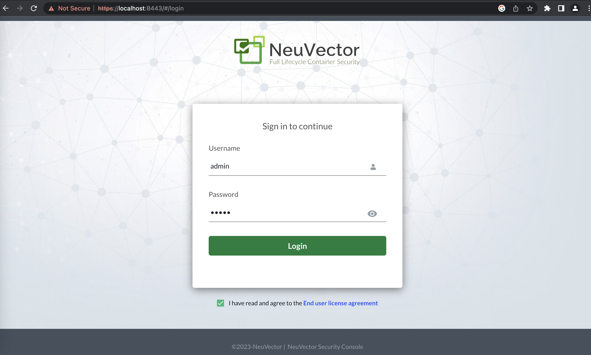
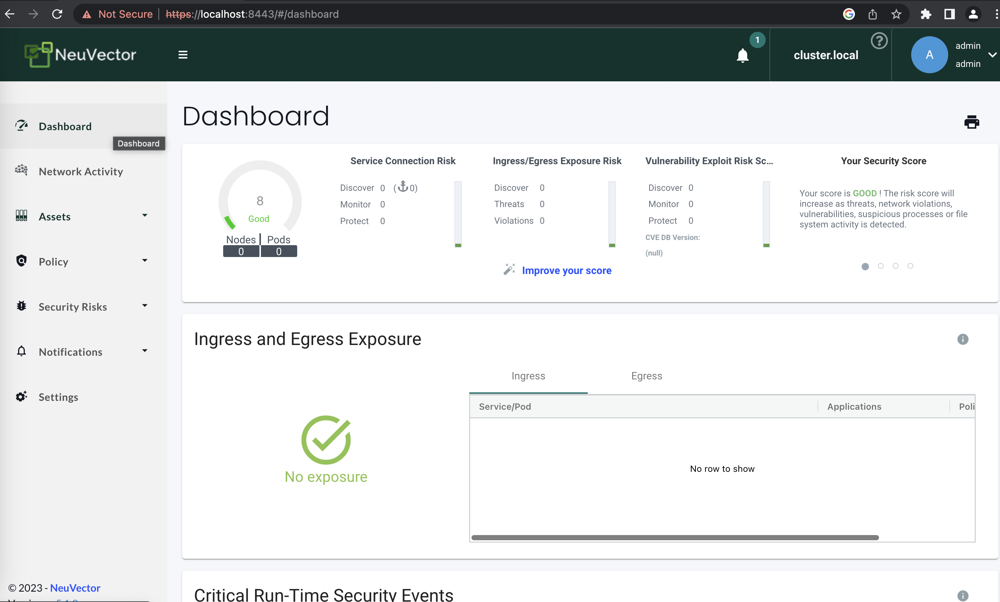

# NEUVECTOR  DEMO

## References
- Official <a href="https://github.com/neuvector/neuvector">repository</a>
- Official  <a href="https://open-docs.neuvector.com/">documentation</a>

## Prerequisites
- docker
- minikube

## Instructions

Create a local test cluster with minikube:
```console
minikube start --nodes=5
```

Add the helm repo from NeuVector's Github Pages:
```console
helm repo add neuvector https://neuvector.github.io/neuvector-helm/
```


Verify the helm repo:
```console
helm search repo neuvector
```


Instal neuvector via Helm:
```console
helm upgrade --install neuvector neuvector/core --version 2.4.2 \
--set tag=5.1.0 \
--set registry=docker.io \
--create-namespace \
--namespace neuvector
```

The output of the previous command is:
```console
Release "neuvector" does not exist. Installing it now.
NAME: neuvector
LAST DEPLOYED: Thu Mar  2 15:08:59 2023
NAMESPACE: neuvector
STATUS: deployed
REVISION: 1
TEST SUITE: None
NOTES:
Get the NeuVector URL by running these commands:
  NODE_PORT=$(kubectl get --namespace neuvector -o jsonpath="{.spec.ports[0].nodePort}" services neuvector-service-webui)
  NODE_IP=$(kubectl get nodes --namespace neuvector -o jsonpath="{.items[0].status.addresses[0].address}")
  echo https://$NODE_IP:$NODE_PORT
```

Watch the pods creation:
```console
❯ kubectl -n neuvector get pods -w

NAME                                        READY   STATUS              RESTARTS   AGE
neuvector-controller-pod-5fb7646b74-2q4md   0/1     ContainerCreating   0          27s
neuvector-controller-pod-5fb7646b74-8mxwb   0/1     ContainerCreating   0          27s
neuvector-controller-pod-5fb7646b74-ffzgv   0/1     ContainerCreating   0          27s
neuvector-enforcer-pod-cpcrg                0/1     ContainerCreating   0          27s
neuvector-enforcer-pod-jd5rf                0/1     ContainerCreating   0          27s
neuvector-enforcer-pod-jjq67                1/1     Running             0          27s
neuvector-manager-pod-74c6c966f9-jtpjc      1/1     Running             0          27s
neuvector-scanner-pod-58dd8685b-ftzj2       1/1     Running             0          27s
neuvector-scanner-pod-58dd8685b-gldlp       1/1     Running             0          27s
neuvector-scanner-pod-58dd8685b-mzfw9       0/1     ContainerCreating   0          27s
neuvector-controller-pod-5fb7646b74-ffzgv   0/1     Running             0          31s
neuvector-enforcer-pod-jd5rf                1/1     Running             0          34s
```

<br/>

When all pods are up and running, we need to Port forward neuvector web ui service, for example:
```console
kubectl port-forward --namespace neuvector service/neuvector-service-webui 8443
```

Now we can reach the interface at the following url: `https://localhost:8443`
<br/>
(login with default credentials: `admin`, `admin`)

<div style="width: 85%; height: 65%">

  
  
</div>
<br/>

<br/>

Now you can explore NeuVector Dashboard and experiment with it (see the `References` paragraph of the current document)
<div style="width: 85%; height: 65%">

  
  
</div>
<br/>


