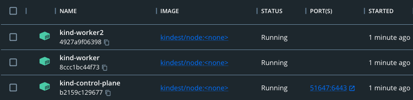

# GETTING STARTED WITH OPEN POLICY AGENT ON KUBERNETES
Your first hands on with OPA's *Gatekeeper* on kubernetes.
<br/>

## Prerequisites
- `helm`
- `kubectl`
- a kubernetes cluster (we will use <a href="https://github.com/kubernetes-sigs/kind">kind</a>).

<br/>

## Instructions
Start a 2 nodes kind cluster:  

```console
kind create cluster --config kind-manifest.yml
```

<br/>

Output:  
```console
❯ kind create cluster --config kind-manifest.yml
Creating cluster "kind" ...
 ✓ Ensuring node image (kindest/node:v1.25.3) 🖼 
 ✓ Preparing nodes 📦 📦 📦  
 ✓ Writing configuration 📜 
 ✓ Starting control-plane 🕹️ 
 ✓ Installing CNI 🔌 
 ✓ Installing StorageClass 💾 
 ✓ Joining worker nodes 🚜 
Set kubectl context to "kind-kind"
You can now use your cluster with:

kubectl cluster-info --context kind-kind

Thanks for using kind! 😊
```
<br/>

You can also inspect the docker running containers to see the ones making up your cluster:  
<br/>
<div style="width: 65%; height: 65%">

  
  
</div>  
<br/> 

Install gatekeeper via *helm* (this will also create a `gatekeeper-system` namespace and install all gatekeeper resources there):  
```console
helm repo add gatekeeper https://open-policy-agent.github.io/gatekeeper/charts \
&& helm install -n gatekeeper-system gatekeeper gatekeeper/gatekeeper --create-namespace
```

<br/>

Output:  
```console
"gatekeeper" has been added to your repositories
NAME: gatekeeper
LAST DEPLOYED: Mon Dec  5 12:00:07 2022
NAMESPACE: gatekeeper-system
STATUS: deployed
REVISION: 1
TEST SUITE: None
```
<br/>

inspect the pods in the created namespace:  
```console
❯ kubectl get pods -n gatekeeper-system
NAME                                             READY   STATUS    RESTARTS   AGE
gatekeeper-audit-78b6c798d-qjwms                 1/1     Running   0          70s
gatekeeper-controller-manager-6d4b55854b-mmz4d   1/1     Running   0          70s
gatekeeper-controller-manager-6d4b55854b-nhn52   1/1     Running   0          69s
gatekeeper-controller-manager-6d4b55854b-wdznj   1/1     Running   0          69s
```

<br/>

Next we need to apply to our cluster both the opa template, which is a
<br/>
kubernetes *CustomResourceDefinition* (CRD) and the actual opa constraint:  
```console
kubectl apply -f no-pod-template-opa.yml \
&& kubectl apply -f no-pod-constraint-opa.yml
```

<br/>

Note that our logics is defined in the `no-pod-template-opa.yml` manifest.
<br/>
OPA uses the <a href="https://www.openpolicyagent.org/docs/latest/policy-language/">rego</a> language to describe policies.
<br/>
Basically we are telling Gatekeeper the following:
<br/>
<br/>
When Kubernetes api-server receives a request to generate a "*Pod*" resource inside the "*no-pods-namespace*" namespace,  
send a request to the *Gatekeeper controller’s webhook* and execute logic we wrote in the template for validation: in this case, deny the request.

<br/>

Let's test our policy!
<br/>

first we will create two namespaces: `namespace-for-pods` and `no-pods-namespace`:  
```console
kubectl create namespace namespace-for-pods \
&& kubectl create namespace no-pods-namespace
```

<br/>

Next wi will create a *Pod* resource on the `namespace-for-pods` namespace:  
```console
kubectl -n namespace-for-pods apply -f test-pod.yml \
&& kubectl -n namespace-for-pods get pods
```

<br/>

Output:  
```console
NAME    READY   STATUS              RESTARTS   AGE
nginx   0/1     ContainerCreating   0          0s
```
<br/>
As expected, the procedure is succesfull.
<br/>

Let's now do the same thing but targeting the `no-pods-namespace` namespace:  
```console
kubectl -n no-pods-namespace apply -f test-pod.yml \
&& kubectl -n no-pods-namespace get pods
```

<br/>

Output:  
```console
Error from server (Forbidden): error when creating "test-pod.yml": admission webhook "validation.gatekeeper.sh" denied the request: [deploymentconstraint] You cannot create a resource of type 'Pod' in this namespace
```

<br/>

As we can see `gatekeeper` correctly prevent us for creating pods in this namespace.
<br/>
This concludes our first demo !
<br/>


