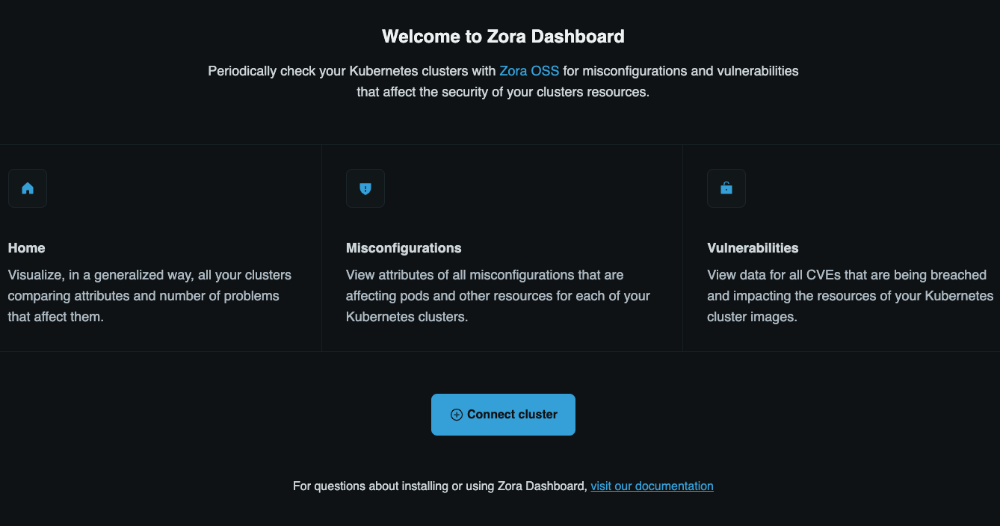
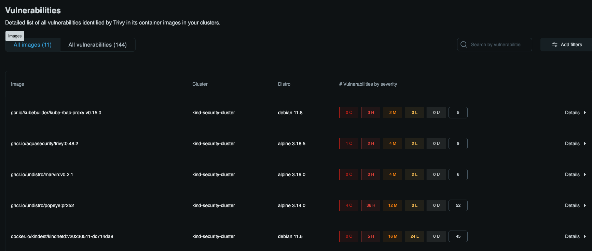

# ZORA

[Zora](https://github.com/aquasecurity/trivy-operator) is an open-source solution that helps you achieve compliance with Kubernetes best practices recommended by industry-leading frameworks.  


## Prerequisites

- Docker
- Helm
- KinD
- Kubectl

## Instructions to test

Launch a local cluster with *KinD*

```console
kind create cluster --name security-cluster --config test/cluster-config.yaml
```   

Now sign in at [zora-dashboard](https://zora-dashboard.undistro.io/login) and click on Conncet cluster:  
  

This will generate the helm command to install zora (Open source) on your cluster and connect it to the zora dashboard (SaaS Service).  


Install `zora` via the helm command:  
```console
helm repo add undistro https://charts.undistro.io --force-update
helm repo update undistro
helm upgrade --install zora undistro/zora \
  -n zora-system \
  --create-namespace \
  --wait \
  --set clusterName="$(kubectl config current-context)" \
  --set saas.workspaceID='<workspace-id-here>'
```  

This command will install Zora in zora-system namespace, creating the namespace if it doesn't already exist and then link your cluster to the zora dahsboard.  


Retrieve the `ClusterScan` resource in yaml format:  
```console
kubectl -n zora-system get ClusterScan kind-security-cluster-vuln -o yaml 
```  
```yaml
apiVersion: zora.undistro.io/v1alpha1
kind: ClusterScan
metadata:
  annotations:
    meta.helm.sh/release-name: zora
    meta.helm.sh/release-namespace: zora-system
  creationTimestamp: "2024-01-29T12:16:57Z"
  finalizers:
  - clusterscan.zora.undistro.io/finalizer
  generation: 1
  labels:
    app.kubernetes.io/instance: zora
    app.kubernetes.io/managed-by: Helm
    app.kubernetes.io/name: zora
    app.kubernetes.io/version: v0.8.0
    cluster: kind-security-cluster
    helm.sh/chart: zora-0.8.0
    zora.undistro.io/default: "true"
  name: kind-security-cluster-vuln
  namespace: zora-system
  ownerReferences:
  - apiVersion: zora.undistro.io/v1alpha1
    blockOwnerDeletion: true
    controller: true
    kind: Cluster
    name: kind-security-cluster
    uid: 498d6611-276b-4aad-a18a-b2a893ea4d01
  resourceVersion: "2133"
  uid: 7c962a6d-8281-44e4-a9f2-5162264261da
spec:
  clusterRef:
    name: kind-security-cluster
  failedScansHistoryLimit: 1
  plugins:
  - name: trivy
  schedule: 21 12 * * *
  successfulScansHistoryLimit: 1
status:
  conditions:
  - lastTransitionTime: "2024-01-29T12:17:17Z"
    message: 'cluster scan successfully configured for plugins: trivy'
    observedGeneration: 1
    reason: ClusterScanReconciled
    status: "True"
    type: Ready
  - lastTransitionTime: "2024-01-29T12:17:17Z"
    message: cluster scan successfully synced with SaaS
    observedGeneration: 1
    reason: OK
    status: "True"
    type: SaaS
  lastFinishedStatus: Complete
  lastFinishedTime: "2024-01-29T12:24:38Z"
  lastScheduleTime: "2024-01-29T12:21:00Z"
  lastStatus: Complete
  lastSuccessfulTime: "2024-01-29T12:24:38Z"
  nextScheduleTime: "2024-01-30T12:21:00Z"
  observedGeneration: 1
  pluginNames: trivy
  plugins:
    trivy:
      lastFinishedStatus: Complete
      lastFinishedTime: "2024-01-29T12:24:38Z"
      lastScanID: 4ba107f1-f7df-4481-a877-09c4aad09c19
      lastScheduleTime: "2024-01-29T12:21:00Z"
      lastStatus: Complete
      lastSuccessfulScanID: 4ba107f1-f7df-4481-a877-09c4aad09c19
      lastSuccessfulTime: "2024-01-29T12:24:38Z"
      nextScheduleTime: "2024-01-30T12:21:00Z"
  processedPluginStatus:
    marvin:
      issueCount: 19
      lastFinishedScanTime: "2024-01-29T12:22:23Z"
      lastSuccessfulScanID: bc9662b9-5207-4791-9380-65ca6e91ee84
      lastSuccessfulScanTime: "2024-01-29T12:22:23Z"
      nextScheduleScanTime: "2024-01-29T13:21:00Z"
      scan:
        id: bc9662b9-5207-4791-9380-65ca6e91ee84
        status: scanned
      schedule: 21 * * * *
    popeye:
      issueCount: 17
      lastFinishedScanTime: "2024-01-29T12:22:23Z"
      lastSuccessfulScanID: eda6023f-d17b-4481-9f4e-7bc5de08dee7
      lastSuccessfulScanTime: "2024-01-29T12:22:23Z"
      nextScheduleScanTime: "2024-01-29T13:21:00Z"
      scan:
        id: eda6023f-d17b-4481-9f4e-7bc5de08dee7
        status: scanned
      schedule: 21 * * * *
    trivy:
      lastFinishedScanTime: "2024-01-29T12:24:38Z"
      lastSuccessfulScanID: 4ba107f1-f7df-4481-a877-09c4aad09c19
      lastSuccessfulScanTime: "2024-01-29T12:24:38Z"
      nextScheduleScanTime: "2024-01-30T12:21:00Z"
      scan:
        id: 4ba107f1-f7df-4481-a877-09c4aad09c19
        status: scanned
      schedule: 21 12 * * *
  processedVulnerabilities:
    trivy:
      zora-system/kind-security-cluster-dockeriokindestkindnetdv20230511dc714da8-zjvdh: "2092"
      zora-system/kind-security-cluster-dockeriokindestlocalpathprovisionerv20230511dc714da8-zjvdh: "2107"
      zora-system/kind-security-cluster-gcriokubebuilderkuberbacproxyv0150-zjvdh: "2114"
      zora-system/kind-security-cluster-ghcrioaquasecuritytrivy0482-zjvdh: "2122"
      zora-system/kind-security-cluster-ghcrioundistromarvinv021-zjvdh: "2115"
      zora-system/kind-security-cluster-ghcrioundistropopeyepr252-zjvdh: "2120"
      zora-system/kind-security-cluster-registryk8sioetcd3570-zjvdh: "2098"
      zora-system/kind-security-cluster-registryk8siokubeapiserverv1273-zjvdh: "2109"
      zora-system/kind-security-cluster-registryk8siokubecontrollermanagerv1273-zjvdh: "2113"
      zora-system/kind-security-cluster-registryk8siokubeproxyv1273-zjvdh: "2097"
      zora-system/kind-security-cluster-registryk8siokubeschedulerv1273-zjvdh: "2111"
  suspend: false
```  

This is one of the CRD that Zora install, in the detail this is the CRD responsible for the trivy scans.  
Wait for the scan to run (or update the scheduler) and then observe the results from the dashboard:  
  

Explore the cluster and the CRDs, for example:  
```console
kubectl -n zora-system get clusterissues kind-security-cluster-pop-712-976cv -o yaml
```  
```yaml
apiVersion: zora.undistro.io/v1alpha1
kind: ClusterIssue
metadata:
  creationTimestamp: "2024-01-29T12:21:32Z"
  generation: 1
  labels:
    category: Node
    cluster: kind-security-cluster
    clusterUID: 498d6611-276b-4aad-a18a-b2a893ea4d01
    custom: "false"
    id: POP-712
    plugin: popeye
    scanID: eda6023f-d17b-4481-9f4e-7bc5de08dee7
    severity: Low
  name: kind-security-cluster-pop-712-976cv
  namespace: zora-system
  ownerReferences:
  - apiVersion: batch/v1
    kind: Job
    name: kind-security-cluster-misconfig-popeye-28442181
    uid: eda6023f-d17b-4481-9f4e-7bc5de08dee7
  resourceVersion: "1586"
  uid: 8f441469-9da9-4ea9-bbc8-3a916ab3d07d
spec:
  category: Node
  cluster: kind-security-cluster
  id: POP-712
  message: Found only one master node
  resources:
    v1/nodes:
    - security-cluster-control-plane
  severity: Low
  totalResources: 1
  url: https://kubernetes.io/docs/concepts/overview/components/
```  


## Next steps

Dive deeper by exploring the [official documentation](https://zora-docs.undistro.io/latest/).


