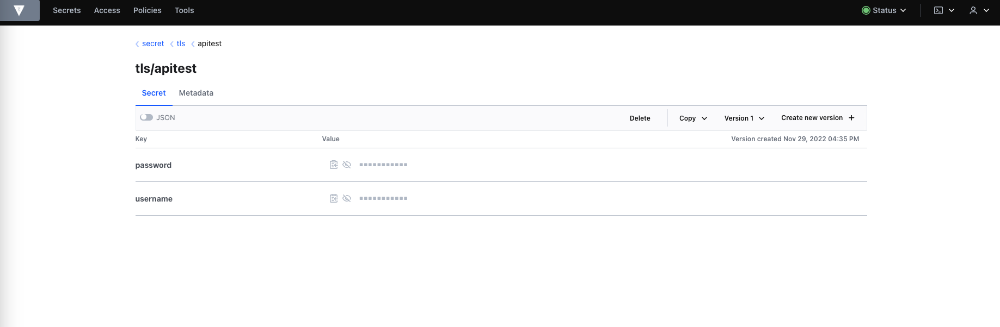

# INSTALL VAULT ON KUBERNETES
Follow these instructions in order to install `vault` (secure secrets manager tool) on your Kubernetes cluster.

## Instructions
The following are from Hashicorp official docs.
<br/>
Install the latest vault helm chart:
```console
helm repo add hashicorp https://helm.releases.hashicorp.com \
&& helm repo update \
&& helm search repo hashicorp/vault
```

<br/>

Create a temp folder and export some env vars:
```console
mkdir /tmp/vault  \
&& export VAULT_K8S_NAMESPACE="vault" \
&& export VAULT_HELM_RELEASE_NAME="vault" \
&& export VAULT_SERVICE_NAME="vault-internal" \
&& export K8S_CLUSTER_NAME="cluster.local" \
&& export WORKDIR=/tmp/vault
```

<br/>

Generate the TLS Cert's private key:
```console
openssl genrsa -out ${WORKDIR}/vault.key 2048
```
<br/>

Create the Certificate Signing Request (CSR):
```console
cat > ${WORKDIR}/vault-csr.conf <<EOF
[req]
default_bits = 2048
prompt = no
encrypt_key = yes
default_md = sha256
distinguished_name = kubelet_serving
req_extensions = v3_req
[ kubelet_serving ]
O = system:nodes
CN = system:node:*.${VAULT_HELM_RELEASE_NAME}.svc.${K8S_CLUSTER_NAME}
[ v3_req ]
basicConstraints = CA:FALSE
keyUsage = nonRepudiation, digitalSignature, keyEncipherment, dataEncipherment
extendedKeyUsage = serverAuth, clientAuth
subjectAltName = @alt_names
[alt_names]
DNS.1 = *.${VAULT_SERVICE_NAME}
DNS.2 = *.${VAULT_SERVICE_NAME}.${VAULT_HELM_RELEASE_NAME}.svc.${K8S_CLUSTER_NAME}
DNS.3 = *.${VAULT_HELM_RELEASE_NAME}
DNS.4 = ${VAULT_HELM_RELEASE_NAME}.${VAULT_HELM_RELEASE_NAME}.svc
IP.1 = 127.0.0.1
EOF
```
<br/>

and then:
<br/>

```console
openssl req -new -key ${WORKDIR}/vault.key -out ${WORKDIR}/vault.csr -config ${WORKDIR}/vault-csr.conf
```
<br/>

Create the csr yaml file to send it to Kubernetes:
```console
cat > ${WORKDIR}/csr.yaml <<EOF
apiVersion: certificates.k8s.io/v1
kind: CertificateSigningRequest
metadata:
   name: vault.svc
spec:
   signerName: kubernetes.io/kubelet-serving
   expirationSeconds: 8640000
   request: $(cat ${WORKDIR}/vault.csr|base64|tr -d '\n')
   usages:
   - digital signature
   - key encipherment
   - server auth
EOF
```
<br/>

Create the `certificate signing request` resources on Kubernetes:
```console
kubectl create -f ${WORKDIR}/csr.yaml
```  
If you check your cluster resources, you can see a `csr` in pending state:  

```console
kubectl get csr -n all | grep Pending
vault.svc   4m50s   kubernetes.io/kubelet-serving                 minikube-user          100d                Pending
```
<br/>

Now go ahead and approve the request:

```console
kubectl certificate approve vault.svc
```
<br/>

Store the certificates and Key in the Kubernetes secrets store.
<br/>
Retrieve the certificate:  
```console
 kubectl get csr vault.svc -o jsonpath='{.status.certificate}' | openssl base64 -d -A -out ${WORKDIR}/vault.crt
```
<br/>

Retrieve Kubernetes CA certificate:  
```console
 kubectl config view \
--raw \
--minify \
--flatten \
-o jsonpath='{.clusters[].cluster.certificate-authority-data}' \
| base64 -d > ${WORKDIR}/vault.ca
```
<br/>

Create the Kubernetes namespace:  
```console
 kubectl create namespace $VAULT_K8S_NAMESPACE
```
<br/>

Create the TLS secret:  
```console
 kubectl create secret generic vault-ha-tls \
   -n $VAULT_K8S_NAMESPACE \
   --from-file=vault.key=${WORKDIR}/vault.key \
   --from-file=vault.crt=${WORKDIR}/vault.crt \
   --from-file=vault.ca=${WORKDIR}/vault.ca
```
<br/>

Deploy the vault cluster via helm with overrides.  
Create the overrides.yaml file:  
```console
 cat > ${WORKDIR}/overrides.yaml <<EOF
global:
   enabled: true
   tlsDisable: false
injector:
   enabled: true
server:
   extraEnvironmentVars:
      VAULT_CACERT: /vault/userconfig/vault-ha-tls/vault.ca
      VAULT_TLSCERT: /vault/userconfig/vault-ha-tls/vault.crt
      VAULT_TLSKEY: /vault/userconfig/vault-ha-tls/vault.key
   volumes:
      - name: userconfig-vault-ha-tls
        secret:
         defaultMode: 420
         secretName: vault-ha-tls
   volumeMounts:
      - mountPath: /vault/userconfig/vault-ha-tls
        name: userconfig-vault-ha-tls
        readOnly: true
   standalone:
      enabled: false
   affinity: ""
   ha:
      enabled: true
      replicas: 3
      raft:
         enabled: true
         setNodeId: true
         config: |
            ui = true
            listener "tcp" {
               tls_disable = 0
               address = "[::]:8200"
               cluster_address = "[::]:8201"
               tls_cert_file = "/vault/userconfig/vault-ha-tls/vault.crt"
               tls_key_file  = "/vault/userconfig/vault-ha-tls/vault.key"
               tls_client_ca_file = "/vault/userconfig/vault-ha-tls/vault.ca"
            }
            storage "raft" {
               path = "/vault/data"
            }
            disable_mlock = true
            service_registration "kubernetes" {}
EOF
```
<br/>

Deploy the Cluster:  
```console
 helm install -n $VAULT_K8S_NAMESPACE $VAULT_HELM_RELEASE_NAME hashicorp/vault -f ${WORKDIR}/overrides.yaml
```
<br/>
Example output:  

```console
NAME: vault
LAST DEPLOYED: Thu Nov  3 19:47:36 2022
NAMESPACE: vault
STATUS: deployed
REVISION: 1
NOTES:
Thank you for installing HashiCorp Vault!
```
<br/>

Display the pods in the namespace that we created for vault:  
```console
kubectl -n $VAULT_K8S_NAMESPACE get pods
NAME                                    READY   STATUS    RESTARTS   AGE
vault-0                                 0/1     Running   0          22s
vault-1                                 0/1     Running   0          22s
vault-2                                 0/1     Running   0          22s
vault-agent-injector-6679b665fd-92n5q   1/1     Running   0          23s
```
<br/>

Initialize vault-0 with one key share and one key threshold:  

```console
kubectl exec -n $VAULT_K8S_NAMESPACE vault-0 -- vault operator init \
-key-shares=1 \
-key-threshold=1 \
-format=json > ${WORKDIR}/cluster-keys.json
```
<br/>

The operator init command generates a root key that it disassembles into key shares -key-shares=1 and then sets the number of key shares required to unseal Vault -key-threshold=1.
<br/>
These key shares are written to the output as unseal keys in JSON format -format=json.
<br/> 
Here the output is redirected to a file named `cluster-keys.json`.

Display the unseal key found in cluster-keys.json:  
```console
jq -r ".unseal_keys_b64[]" ${WORKDIR}/cluster-keys.json
pcSJU0M2ijTXMCKK5Tc2AtKCs7XCA5/kgaj5yVbSWGo=
```
<br/>

*Insecure operation*: Do not run an unsealed Vault in production with a single key share and a single key threshold.
<br/>
This approach is only used here to simplify the unsealing process for this demonstration.
<br/>
Create a variable named VAULT_UNSEAL_KEY to capture the Vault unseal key:  
```console
VAULT_UNSEAL_KEY=$(jq -r ".unseal_keys_b64[]" ${WORKDIR}/cluster-keys.json)
```
<br/>

After initialization, Vault is configured to know where and how to access the storage, but does not know how to decrypt any of it.
<br/>
Unsealing is the process of constructing the root key necessary to read the decryption key to decrypt the data, allowing access to the Vault.
<br/>


Unseal Vault running on the vault-0 pod:  

```console
kubectl exec -n $VAULT_K8S_NAMESPACE vault-0 -- vault operator unseal $VAULT_UNSEAL_KEY
```
<br/>

*Insecure operation*: Providing the unseal key with the command writes the key to your shell's history.
<br/>
This approach is only used here to simplify the unsealing process for this demonstration.
<br/>
<br/>

The operator unseal command reports that Vault is initialized and unsealed.  
Example output:  
```console
Key                     Value
---                     -----
Seal Type               shamir
Initialized             true
Sealed                  false
Total Shares            1
Threshold               1
Version                 1.12.1
Build Date              2022-10-27T12:32:05Z
Storage Type            raft
Cluster Name            vault-cluster-cbe1dda9
Cluster ID              953bbfe3-11b8-4687-9600-df0c49eb242a
HA Enabled              true
HA Cluster              https://vault-0.vault-internal:8201
HA Mode                 active
Active Since            2022-11-29T15:08:13.85591676Z
Raft Committed Index    36
Raft Applied Index      36
```
<br/>

Start an interactive shell session on the vault-1 pod:  
```console
kubectl exec -n $VAULT_K8S_NAMESPACE -it vault-1 -- /bin/sh
```
<br/>

Join the vault-1 pod to the Raft cluster:  
```console
vault operator raft join -address=https://vault-1.vault-internal:8200 -leader-ca-cert="$(cat /vault/userconfig/vault-ha-tls/vault.ca)" -leader-client-cert="$(cat /vault/userconfig/vault-ha-tls/vault.crt)" -leader-client-key="$(cat /vault/userconfig/vault-ha-tls/vault.key)" https://vault-0.vault-internal:8200 && exit
```
<br/>

Unseal vault-1:  
```console
kubectl exec -n $VAULT_K8S_NAMESPACE -ti vault-1 -- vault operator unseal $VAULT_UNSEAL_KEY
```
<br/>

Start an interactive shell session on the vault-2 pod:  
```console
kubectl exec -n $VAULT_K8S_NAMESPACE -it vault-2 -- /bin/sh
```
<br/>

Join the vault-2 pod to the Raft cluster:  
```console
vault operator raft join -address=https://vault-2.vault-internal:8200 -leader-ca-cert="$(cat /vault/userconfig/vault-ha-tls/vault.ca)" -leader-client-cert="$(cat /vault/userconfig/vault-ha-tls/vault.crt)" -leader-client-key="$(cat /vault/userconfig/vault-ha-tls/vault.key)" https://vault-0.vault-internal:8200 && exit
```
<br/>

Unseal vault-2:  
```console
kubectl exec -n $VAULT_K8S_NAMESPACE -ti vault-2 -- vault operator unseal $VAULT_UNSEAL_KEY
```
<br/>


Login to vault and confirm everything is working.  
Export the cluster root token:  
```console
export CLUSTER_ROOT_TOKEN=$(cat ${WORKDIR}/cluster-keys.json | jq -r ".root_token")
```

<br/>

Login to vault-0 with the root token:  
```console
kubectl exec -n $VAULT_K8S_NAMESPACE vault-0 -- vault login $CLUSTER_ROOT_TOKEN

Success! You are now authenticated. The token information displayed below
is already stored in the token helper. You do NOT need to run "vault login"
again. Future Vault requests will automatically use this token.

Key                  Value
---                  -----
token                hvs.GkvZ4M2s4waVUg8EXQd3Va6W
token_accessor       EYrdUf1nvwok2EQ6jLO8wGFO
token_duration       ∞
token_renewable      false
token_policies       ["root"]
identity_policies    []
policies             ["root"]
```
<br/>

List the raft peers:  
```console
kubectl exec -n $VAULT_K8S_NAMESPACE vault-0 -- vault operator raft list-peers

Node       Address                        State       Voter
----       -------                        -----       -----
vault-0    vault-0.vault-internal:8201    leader      true
vault-1    vault-1.vault-internal:8201    follower    true
vault-2    vault-2.vault-internal:8201    follower    true
```
<br/>

Print the HA status:  
```console
kubectl exec -n $VAULT_K8S_NAMESPACE vault-0 -- vault status

Key                     Value
---                     -----
Seal Type               shamir
Initialized             true
Sealed                  false
Total Shares            1
Threshold               1
Version                 1.12.1
Build Date              2022-10-27T12:32:05Z
Storage Type            raft
Cluster Name            vault-cluster-cbe1dda9
Cluster ID              953bbfe3-11b8-4687-9600-df0c49eb242a
HA Enabled              true
HA Cluster              https://vault-0.vault-internal:8201
HA Mode                 active
Active Since            2022-11-29T15:08:13.85591676Z
Raft Committed Index    42
Raft Applied Index      42
```
<br/>

We now have a working 3 node cluster with TLS enabled at the pod level.
<br/>
Next we will create a secret and retrieve it via and API call to confirm TLS is working as expected.
<br/>


Create a secret  
Start an interactive shell session on the vault-0 pod:  
```console
kubectl exec -n $VAULT_K8S_NAMESPACE -it vault-0 -- /bin/sh
```
<br/>

Enable the kv-v2 secrets engine:  
```console
vault secrets enable -path=secret kv-v2
Success! Enabled the kv-v2 secrets engine at: secret/
```
<br/>

Create a secret at the path secret/tls/apitest with a username and a password:  
```console
vault kv put secret/tls/apitest username="r3drun3" password="!Thi-s.ShouldBeDifficu_ltEnough!"

===== Secret Path =====
secret/data/tls/apitest

======= Metadata =======
Key                Value
---                -----
created_time       2022-11-29T15:35:33.742356172Z
custom_metadata    <nil>
deletion_time      n/a
destroyed          false
version            1
```
<br/>

Verify that the secret is defined at the path secret/tls/apitest:  
```console
vault kv get secret/tls/apitest

===== Secret Path =====
secret/data/tls/apitest

======= Metadata =======
Key                Value
---                -----
created_time       2022-11-29T15:35:33.742356172Z
custom_metadata    <nil>
deletion_time      n/a
destroyed          false
version            1

====== Data ======
Key         Value
---         -----
password    !Thi-s.ShouldBeDifficu_ltEnough!
username    r3drun3
```
<br/>

Exit the vault-0 pod:  
```console
exit
```
<br/>

Expose the vault service and and retrieve the secret via the API.
<br/>
The Helm chart defined a Kubernetes service named vault that forwards requests to its endpoints (i.e. The pods named vault-0, vault-1, and vault-2).
<br/>

Confirm the Vault service configuration:  
```console
kubectl -n $VAULT_K8S_NAMESPACE get service vault

NAME    TYPE        CLUSTER-IP       EXTERNAL-IP   PORT(S)             AGE
vault   ClusterIP   10.107.106.180   <none>        8200/TCP,8201/TCP   46m
```
<br/>

In another terminal, port forward the vault service:  
```console
kubectl -n vault port-forward service/vault 8200:8200

Forwarding from 127.0.0.1:8200 -> 8200
Forwarding from [::1]:8200 -> 8200
```

<br/>

In the original terminal, perform a HTTPS curl request to retrieve the secret we created in the previous section:  
```console
curl --cacert $WORKDIR/vault.ca \
--header "X-Vault-Token: $CLUSTER_ROOT_TOKEN" \
https://127.0.0.1:8200/v1/secret/data/tls/apitest | jq .data.data
```
<br/>

Example output:  
```json
{
  "password": "!Thi-s.ShouldBeDifficu_ltEnough!",
  "username": "r3drun3"
}
```

Finally, having exposed vault, you can also access the web GUI at `https://127.0.0.1:8200/`
<br/> 
and login with the root token:

<br/>
<div style="width: 65%; height: 65%">

  
  
</div>  
<br/> 
