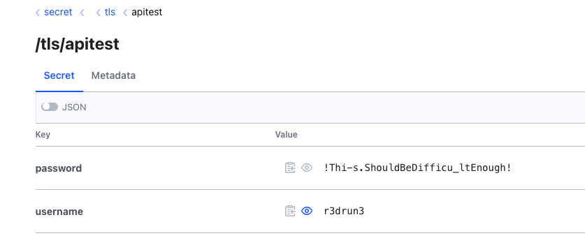

# Authentication and policies

## Instructions
This demo begins exactly where we left off at the end of the first one so make sure you stick with it.
<br/>
<br/>
We are now logged in to the Vault Web GUI as root.
<br/>
We are going to create a new user and associate a read policy (for the secret we previously created) to it.
<br/>
<br/>
Go to `Access` >> `Auth Methods` >> `Enable new method`.
<br/>
Select username and password and click on Enable Method (let all default).
<br/>
Now go back to Auth Methods, click on `Create user`, leave all option as default, insert only the username and the password,
<br/>
<br/>
In my case the username is `dev-1` and the password is `dev-1-password` (yeah I know, I am a security pro! 💪).
<br/>
<br/>
Sign out and Sign In with the newly created user.
<br/>
You will note that you cannot do much and you cannot see the secret that we created in demo-1.
<br/>
<br/>
Why is so? Well we need to create an ACL and associate that to the user.
<br/>
<br/>
Sign out and sign in as root.
<br/>
Go to `Policies` and click on Go to `Create ACL policy`.
<br/>
Insert `read-secrets` as the policy name and paste the following text into the policy corpus:  

```hcl
path "secret/*" {
  capabilities = [ "read" ]
}
```
<br/>

This gives our user read capabilities on the *secret/* path.
<br/>
Now, from the terminal, login to the vault-0 pod:  
```console
kubectl exec -n $VAULT_K8S_NAMESPACE -it vault-0 -- /bin/sh
```
<br/>

and then execute this command to link the user with the ACL policy:  
```console
vault write auth/userpass/users/dev-1/policies policies="read-secrets"

Success! Data written to: auth/userpass/users/dev-1/policies
```
<br/>
If you login again as your user, and click on the secret path, you will be asked for a specific path inside it,  

enter `/tls/apitest/` and now you can read the secret but you cannot modify it!  

<br/>
<div style="width: 65%; height: 65%">

  
  
</div>  
<br/> 

